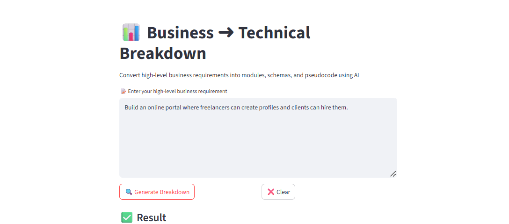

# 🧠 Biz ➜ Tech Auto Tool

A Streamlit-based AI automation tool that transforms **high-level business requirements** into detailed **technical specifications** — including modules, database schemas, and pseudocode.

> ⚡ Powered by [OpenRouter.ai](https://openrouter.ai) and LLaMA 3 (`meta-llama/llama-3-8b-instruct`)

---

## 🚀 Features

- ✍️ Input any business requirement
- 🔍 Generates:
  - Functional Modules
  - Database Schema
  - Python-style Pseudocode
- 🔁 Clear and rerun easily
- ⚙️ Uses free OpenRouter API (no OpenAI subscription required)

---

## 🛠️ Tools & Libraries Used

| Tool/Library     | Purpose                                      |
|------------------|----------------------------------------------|
| `streamlit`      | Frontend web interface                       |
| `requests`       | API call to OpenRouter                       |
| `python-dotenv`  | Secure API key loading                       |
| `OpenRouter.ai`  | Free LLM access (LLaMA 3 / Claude / GPT)     |

---

## 📦 Project Structure

```
business_to_tech_streamlit/
|
|-- app.py                 # Streamlit UI
|-- ai_pipeline.py         # Core AI processing logic
|-- .env                   # API key (not committed)
|-- requirements.txt       # Dependencies
|-- README.md              # This file
```

---

## 🔐 Setup Instructions

### 1. Clone this repo or copy files locally

```bash
git clone https://github.com/ankush-manchanda/business-to-tech.git
cd business_to_tech
```

### 2. Create `.env` file with your API key

Go to [https://openrouter.ai/keys](https://openrouter.ai/keys), create a key, and add to `.env`:

```
OPENROUTER_API_KEY=or-xxxxxxxxxxxxxxxxxxxxxxxx
```

### 3. Install dependencies

```bash
pip install -r requirements.txt
```

### 4. Run the app

```bash
streamlit run app.py
```

---

## 📸 Screenshots



---

## 🔧 Sample Use Case

**Input:**
```
Create a system where doctors can manage appointments and patients can write reviews.
```

**Output:**
- Functional Modules:
  - User Auth
  - Appointment Management
  - Review System
- Schema: `Users`, `Appointments`, `Reviews`
- Pseudocode for major functions

---

## 📘 Model Used

- `meta-llama/llama-3-8b-instruct` via [OpenRouter.ai](https://openrouter.ai/)
- You can swap model with Claude/GPT in `ai_pipeline.py`

---

## 🧠 Credits

Created by **Ankush Manchanda**  
For: AI Automation Task – Convert Business to Technical Specs

---

## 📜 License

MIT License — Free for commercial and personal use.
